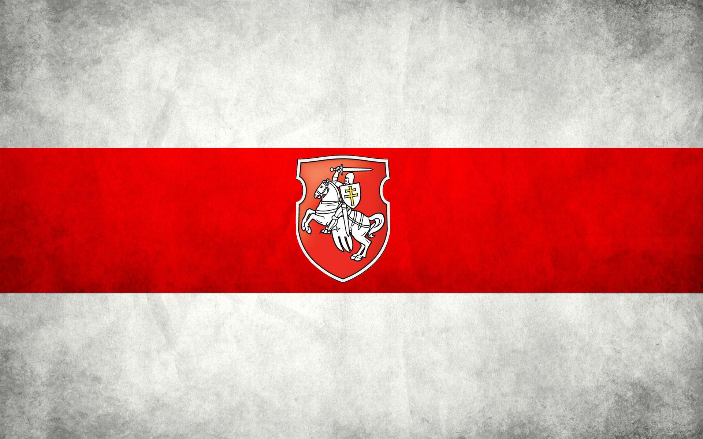

<h1 align="center"> Приветствую, меня зовут Кирилл </h1>
 

Я верстальщик из Беларуси 

Успешно закончил курс по верстке сайтов на платформе <a href="https://annblok.ru/">AnnBlok</a>

В настоящее время занимаюсь разработкой сайтов и с большим удовольствием помогу вам реализовать ваши идеи 

 

Примеры моих работ: 

<a href="https://ponokir.github.io/Burger/index.html" traget="_blank">Сайт бургерной</a>  
<a href="https://ponokir.github.io/Module01-Gym/index.html" traget="_blank">Фитнесс-центр FreeFit</a>  
<a href="https://ponokir.github.io/Module02-Shop/dist/index.html" traget="_blank">Магазин здорового питания</a> 
 
 
 
Связаться со мной можно: 
в <a href="https://t.me/ponokir"> Telegram </a>  
по  <a href="mailto:ponokir@gmail.com"> e-mail </a>
